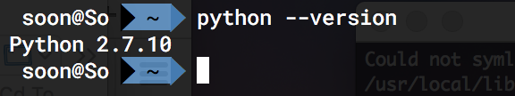
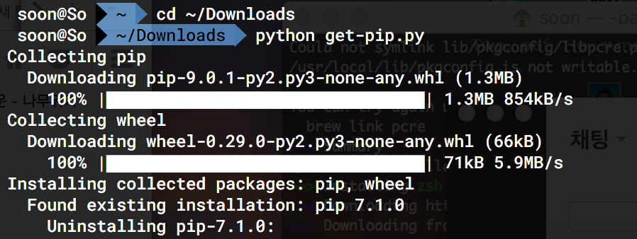
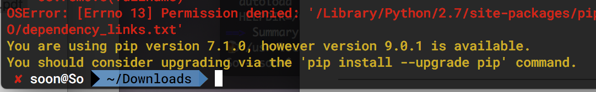
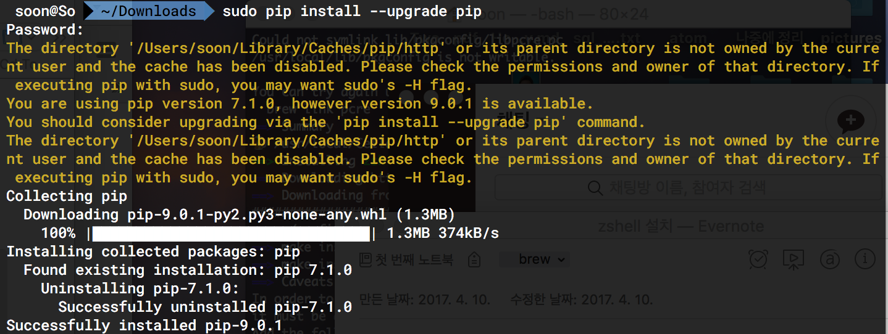
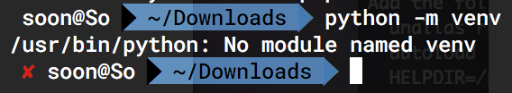

# python, pip, virtualenv, django 환경설정
설치 및 환경설정 과정은 PC개발환경, 원격 서버 개발환경으로 나누어 정리할 것이며, 원격 서버 개발환경 설정은 차후 AWS t2 micro를 발급받아 정리해보려 한다.  

## 1) python설치
mac에는 python2.7이 기본으로 설치 되어있다. python 2.7.x버전의 python을 사용할 것이므로 python설치에 대한 정리는 넘어가기로 한다.  

## 2) pip설치
pip는 python에 사용되는 각종 패키지를 설치, 업그레이드,삭제하도록 하는 패키지 매니저다. pip는 django를 비롯해 python에 관련된 패키지를 쉽고 편하게 관리할 수 있도록 해준다.  
get-pip.py를  https://pip.pypa.io/en/stable/installing/ 에서 다운받아 터미널에서 실행해서 pip를 설치할 수 있다.  

위와 같은 화면이 나타나면서 설치 될 수도 있다. 하지만 나의 경우는 아래와 같이 ‘너는 지금 pip-7.1.0을 쓰고 있어. 9.1.0이 있는데 써봐. pip install —upgrade pip 명령으로 업그레이드 할 수 있어’라는 의미의 메시지가 나왔다.  

따라서 아래와 같이 sudo pip install --upgrade pip을 통해 설치했다. (sudo 를 사용해야 하더라.)  

## 3) virtualenv설치
virtualenv는 가상으로 python환경을 만드는 도구다. 개발환경이 설치된 PC또는 Server의 python버전이 변경되는 등을 할때마다 의존성충돌이 나는 것을 방지할 수 있도록 해주는 도구다. 작업하고 있는 PC또는 서버의 개발환경이 변하거나 python의 버전이 업그레이드 되거나 변하더라도 이전에 지정해놓은 버전위에서 계속돌아가도록 가상환경을 구성해준다.  

가상 python환경을 만드는 도구는 여러가지가 있는데 python3를 사용할 경우 python3에 내장된 python -m venv를 사용할 수도 있다. virtual env가 설치되어있는지 확인하기 위해 python -m venv명령어를 통해 확인해보면  

나의 경우는 이런 화면이 나타났다. python3를 사용하고 있지 않으므로 당연히 이러한 결과가 나타난 것이다. python3가 아닌 python 2.7.x대의 python을 사용할 경우 3가지의 방식을 사용해 virtualenv를 이용할 수 있다. 이에 대한 내용은 아래 정리해둔 url에서 확인가능하다.  
[1-국내 블로그: virtualenv설정을 위한 3가지 방식을 설명](https://dobest.io/how-to-set-python-dev-env/)
[2-해외 블로그: virtualenv설정 방식, 환경변수 추가 등등](http://python-guide-pt-br.readthedocs.io/en/latest/dev/virtualenvs/)

2017년 4월 10일 월요일 현재, 어떤 방식이 더 좋은 방식인지 모른다... 내일 쉬는시간 중간 중간마다 짬짬이 읽어본후 정리해봐야 할 듯하다.  

## 4) virtualenv로 가상환경 설정
[참고자료 - pystagram만들기 강좌](http://blog.hannal.com/2014/8/start_with_django_webframework_02/)
django를 설치하기 전에 virtualenv를 통해 가상환경 설정을 진행후에 하도록 한다. 실습 프로젝트용 가상환경을 생성하여 그 환경내에서 django를 운영하도록 하기 위해서다. virtualenv로 하나의 프로젝트용 가상환경을 만들기 위해서는 아래와 같이 명령어를 입력하면 된다.  
// python3 에서...
$ python3 -m venv env_planner
// python2.7.x 에서...

## 5) django설치

